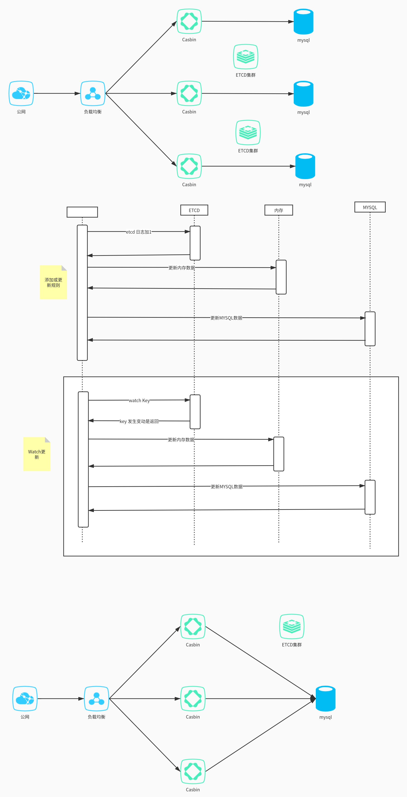

chronos
===
Chronos   Fast and efficient permission validation  (ABAC/RBAC)

### CasbinV2 的ABAC啥玩意  性能如此之低下

### Storage
- [ ] Redis  (分布式实现基于一致性HASH 类似Cassandra)
- [ ] Stele  (支持Raft AND 一致性HASH)

### 进度
- [ ] 基础实现
- [ ] 兼容Casbin API

### Base Config
ABAC
``` 
[request_definition]
r = sub, obj

[policy_definition]
p = name, obj, sub_rule                     # sub_rule: r.sub.Time<1635936065, r.sub.Count<20

[policy_effect]                             # 暂时不适配 
e = some(where (p.eft == allow)) 

[matchers]
m = eval(p.sub_rule) && r.obj == p.obj  && r.sub.Name == p.name
```
RBAC
``` 
[request_definition]
r = sub, obj, act

[policy_definition]
p = sub, obj, act

[role_definition]
g = _, _

[policy_effect]                              # 暂时不适配 
e = some(where (p.eft == allow))

[matchers]
m = g(r.sub, p.sub) && r.obj == p.obj && r.act == p.act
```

### Casbin watch

Casbin 问题 
- 1.初始化数据必须保持一致
- 2.无法解决脑裂问题